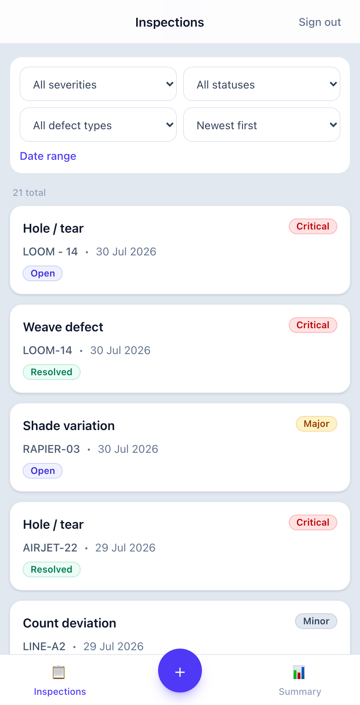
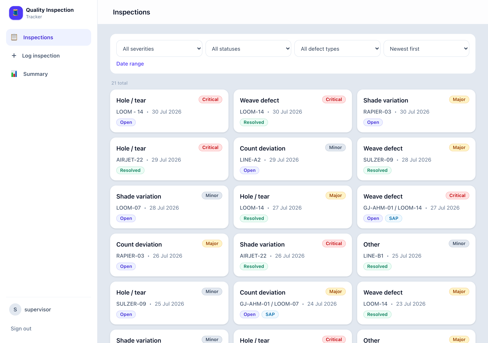
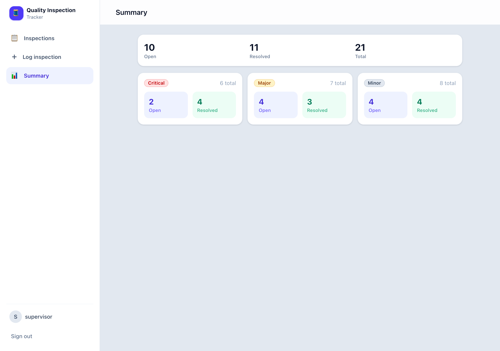
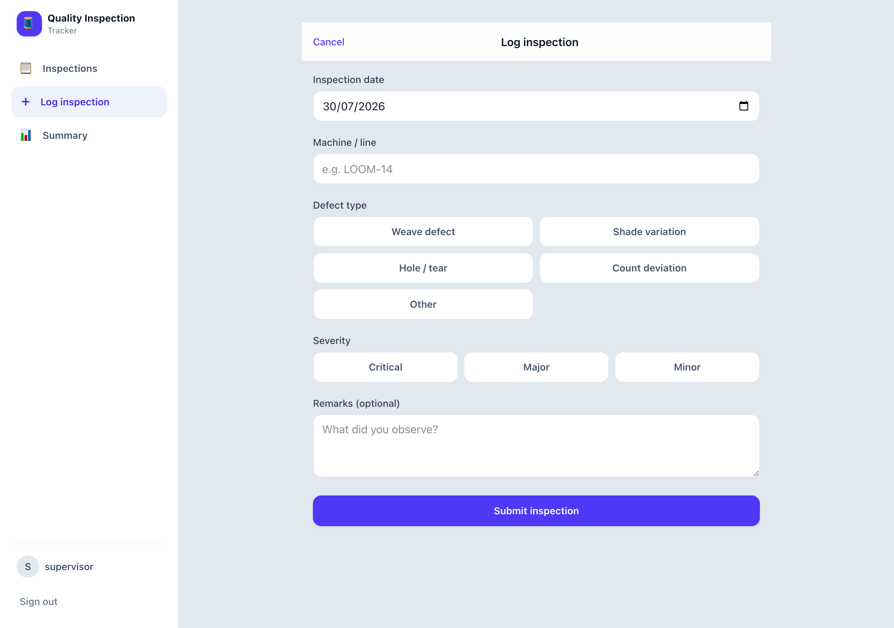

<div align="center">

# 🧵 Quality Inspection Tracker

**A mobile-first web app for fabric-plant shop-floor supervisors to log, filter, resolve, and summarize quality defects — replacing the paper register.**

[](https://www.typescriptlang.org/)
[](https://hono.dev/)
[](https://react.dev/)
[](https://orm.drizzle.team/)
[](#api-reference)
[](#testing)

[](https://quality-inspection-tracker.fly.dev)

One TypeScript codebase: a self-documenting Hono API, a React SPA served from the same process, and SQLite for storage. Runs on **one port** with **one command** — `docker compose up`.

**🔗 Live demo:** **[quality-inspection-tracker.fly.dev](https://quality-inspection-tracker.fly.dev)** — sign in with `supervisor` / `inspect123` (credentials are pre-filled).

</div>

---

## Contents

- [Screenshots](#screenshots)
- [Highlights](#highlights)
- [Quickstart](#quickstart)
- [Tech stack](#tech-stack)
- [Architecture &amp; design decisions](#architecture--design-decisions)
- [Project structure](#project-structure)
- [API reference](#api-reference)
- [Authentication](#authentication)
- [Offline support](#offline-support)
- [Data model](#data-model)
- [Configuration](#configuration)
- [Scripts](#scripts)
- [Testing](#testing)
- [Trade-offs &amp; roadmap](#trade-offs--roadmap)

---

## Screenshots

> **Mobile-first, responsive to desktop.** The base layout targets a phone (verified at 390px). At `md`+ it becomes a two-pane app — a persistent sidebar and a multi-column content area — without changing the mobile experience.

<table>
  <tr>
    <td width="34%"></td>
    <td width="66%"></td>
  </tr>
  <tr>
    <td align="center"><em>Mobile — cards + bottom tab bar</em></td>
    <td align="center"><em>Desktop — sidebar + card grid</em></td>
  </tr>
</table>

<p align="center">
  
  
</p>

---

## Highlights

- **Self-documenting API** — routes are declared once with Zod schemas; the framework validates requests/responses **and** generates the OpenAPI 3 spec, rendered as an interactive [Scalar](https://scalar.com/) UI at `/reference`. No spec to maintain, no drift.
- **Production-grade auth** — short-lived access JWT (in memory) + rotating opaque refresh token (httpOnly cookie), with **refresh-token reuse detection** that revokes the whole token family. Passwords hashed with built-in `scrypt`.
- **Single process, single port** — Hono serves the built SPA and the API together in production; in development it embeds Vite (with HMR) so `npm run dev` is also one port. Nothing to orchestrate.
- **Offline-capable** — create and resolve defects offline; writes queue in IndexedDB and replay idempotently on reconnect (the client mints the record UUID, the server upserts on it).
- **Type-safe end to end** — TypeScript `strict`, no `any` across boundaries. The Zod validators are the single source of truth for both the API contract and the client's types.
- **Zero-config clone-and-run** — boots with safe defaults, auto-migrates, and auto-seeds ~20 realistic inspections on first run.

---

## Quickstart

Seeded login (created automatically on first run):

```
username: supervisor
password: inspect123
```

### Option A — Docker (recommended, one command)

```bash
docker compose up --build        # or: npm run docker:up
```

Open **http://localhost:3000**. First boot applies migrations, seeds the demo data, and serves the SPA + API on one port. Comfortably under 5 minutes.

> `--build` rebuilds the image from the current source, so the container always reflects the latest code — re-run it after any change. `npm run docker:down` stops it; add `-v` (`docker compose down -v`) to reset the database volume.

### Option B — Local (npm)

Requires **Node 20+** (developed on Node 24).

```bash
npm install

# Dev with hot reload — open http://localhost:3000
npm run dev

# …or a single-process production build — open http://localhost:3000
npm run build && npm start
```

No `.env` is required: the app generates an ephemeral `JWT_SECRET` (with a warning) if one isn't set, and every other value has a safe default. See [Configuration](#configuration).

### Interactive API docs

Once running, open **http://localhost:3000/reference** — the Scalar UI lists every endpoint with schemas and examples. Click the lock, paste an access token from `POST /api/auth/login`, and try any protected route live.

---

## Tech stack

| Layer | Choice | Why |
|---|---|---|
| Language | **TypeScript** (`strict`) | One language, end to end; no `any` across boundaries. |
| API framework | **Hono** + `@hono/node-server` | Fast, Web-standard, tiny. |
| API contract & docs | **`@hono/zod-openapi`** + **`stoker`** + **Scalar** | The Zod schema *is* the validation *and* the OpenAPI doc. |
| Database | **SQLite** via `better-sqlite3` | No server to provision; a file on a volume. |
| ORM & migrations | **Drizzle ORM** + `drizzle-kit` | Typed queries, generated migrations. |
| Schemas | **`drizzle-zod`** + **Zod v4** | Select/insert schemas derived from tables, shared with the client. |
| Auth | `hono/jwt` + `node:crypto` `scrypt` | Built-in crypto, no native build step. |
| Frontend | **React 19** + **Vite 7** + **Tailwind CSS 4** | Lean, fast, mobile-first. |
| Server state | **TanStack Query 5** | Caching, invalidation, background refetch. |
| Offline | **`idb`** (IndexedDB) | Small, promise-based write queue + read cache. |
| Tests | **Vitest** | Fast API tests against an in-memory database. |

Single npm package, no workspace. No CSS-in-JS, no auth provider, no state library beyond TanStack Query.

---

## Architecture &amp; design decisions

Each decision below is a deliberate trade-off in favor of a codebase a colleague can pick up and a repo that runs cleanly on the first try.

### Single-process Hono + SPA, one port everywhere

In production, Hono serves the built React assets *and* `/api` on one port, with an SPA fallback for client routes and JSON `404`s for unknown API paths. In development, the same server embeds the Vite dev server in middleware mode (HMR on the same port), so `npm run dev` is one process on `http://localhost:3000`. One thing to run, nothing to orchestrate.

### The schema is the contract (three-file routers)

Every feature is a router split into three files:

- **`*.routes.ts`** — pure `createRoute({...})` definitions: Zod schemas only, no logic.
- **`*.handlers.ts`** — one typed handler per route. A wrong status code or an off-schema response body is a **compile error**, because the handler is generically bound to its route contract.
- **`*.index.ts`** — wires middleware and registers `route → handler`.

The framework validates every request against the route's schema and emits the OpenAPI document from the same schemas — so `/reference` is always accurate, with no separate spec file to maintain.

### Auth: in-memory access token + rotating refresh cookie

A short-lived (~15 min) access JWT lives only in JS memory (never `localStorage`) to limit XSS token theft; a rotating opaque refresh token lives in an `httpOnly`, `SameSite=Lax`, `Path=/api/auth` cookie the page's JS can't read. On load, the client silently refreshes to restore the session without ever persisting the access token. See [Authentication](#authentication) for the full model.

### SQLite + Drizzle

No database server to run; the file lives in `data/` (a Docker volume in the container). Drizzle gives typed queries and `drizzle-kit` migrations, and the summary endpoint is a single grouped SQL aggregation rather than a row scan.

### Client-generated UUIDs for offline idempotency

The client mints each inspection's `id`, and `POST /inspections` upserts on it (existing id → `200`, new id → `201`). An offline resend can therefore never create a duplicate — the backbone of the [offline](#offline-support) feature.

### Shared types via the validators

The client imports the same Zod validators the server uses (`z.infer<typeof selectInspectionSchema>`), so the API response shape and the UI's types can never drift. The client bundle is verified to contain **no server-only code** (no `better-sqlite3`, handlers, or DB client).

---

## Project structure

```
quality-inspection-tracker/
├── Dockerfile / docker-compose.yml     # single-process image, SQLite on a volume
├── drizzle/                            # generated SQL migrations
├── docs/                               # README screenshots
├── src/
│   ├── shared/                         # isomorphic: enums + human-readable labels
│   ├── validators/                     # drizzle-zod + query/summary/auth/SAP schemas
│   ├── server/
│   │   ├── app.ts                      # mounts routers, configures OpenAPI
│   │   ├── index.ts                    # entry: migrate → seed → serve (SPA + API)
│   │   ├── lib/                        # create-app, openapi, scrypt, tokens, env, types
│   │   ├── middlewares/                # require-auth, rate-limit
│   │   ├── db/                         # schema, client (server-only), migrate, seed
│   │   └── routers/                    # health, auth, inspections, summary, sap
│   └── client/
│       ├── lib/                        # apiFetch, auth context, router, queries, offline
│       ├── components/                 # SideNav, BottomNav, cards, badges, icons, ui
│       └── pages/                      # Login, InspectionsList, LogInspection, Detail, Summary
└── test/                               # Vitest: auth, inspections, sap
```

**Client-bundle safety:** the client may import only `src/validators`, `src/shared`, and types from `src/server/db/schema.ts` (pure table defs). It never imports the DB client, handlers, or server `lib/*`.

---

## API reference

Base path `/api`. All inspection and summary endpoints require an `Authorization: Bearer <accessToken>` header.

| Method | Path | Body / Query | Success | Errors |
|---|---|---|---|---|
| `POST` | `/api/auth/login` | `{ username, password }` | `200 { accessToken, user }` + refresh cookie | `401` `429` `422` |
| `POST` | `/api/auth/refresh` | _(refresh cookie)_ | `200 { accessToken }` + rotated cookie | `401` |
| `POST` | `/api/auth/logout` | _(refresh cookie)_ | `204` | — |
| `GET` | `/api/auth/me` | — | `200 { user }` | `401` |
| `GET` | `/api/inspections` | filters + `sort,limit,offset` | `200 { data, meta: { total } }` | `401` `422` |
| `POST` | `/api/inspections` | `insertInspectionSchema` | `201` created / `200` idempotent | `401` `422` |
| `GET` | `/api/inspections/{id}` | — | `200` inspection | `401` `404` `422` |
| `PATCH` | `/api/inspections/{id}/resolve` | `{ resolutionNote }` | `200` inspection | `401` `404` `409` `422` |
| `GET` | `/api/summary` | — | `200` summary matrix | `401` |
| `POST` | `/api/sap/sap-webhook` | SAP payload + `x-webhook-secret` | `201` inspection | `401` `422` |
| `GET` | `/api/health` | — | `200 { status: "ok" }` | — |

**List filters:** `severity`, `status`, `defectType`, `from` / `to` (range on `inspectionDate`), `sort` (`-createdAt` default, `createdAt`, `severity` [critical > major > minor], `inspectionDate`), `limit` (≤ 200), `offset`.

### Response contract

- **Single resource** (get / create / resolve) → the resource object directly.
- **Collections** → `{ "data": Item[], "meta": { "total": number } }` — the envelope carries pagination metadata; single resources don't need it.
- **Validation errors (`422`)** → the shared Zod-error shape:
  ```json
  { "success": false, "error": { "issues": [ ... ], "name": "ZodError" } }
  ```
- **`404` / `409` / `401` / `429`** → `{ "message": string }`.

Server-owned fields are never trusted from the request body: `createdBy` / `resolvedBy` come from the token, and `status` / `resolvedAt` / timestamps are set server-side. The `insert*` schemas `.omit(...)` those columns, and `selectUserSchema.omit({ passwordHash })` guarantees the hash is never serialized.

### Examples

```bash
# Log in
curl -s -X POST localhost:3000/api/auth/login \
  -H 'content-type: application/json' \
  -d '{"username":"supervisor","password":"inspect123"}'
# → { "accessToken": "eyJ…", "user": { "id": "…", "username": "supervisor" } }

# Create an inspection (idempotent on the client-supplied id)
curl -s -X POST localhost:3000/api/inspections \
  -H "authorization: Bearer $TOKEN" -H 'content-type: application/json' \
  -d '{"id":"<uuid>","inspectionDate":"2026-07-30","machineLineId":"LOOM-14",
       "defectType":"weave_defect","severity":"critical","remarks":"Broken pick"}'

# Filter + sort
curl -s "localhost:3000/api/inspections?severity=critical&status=open&sort=severity" \
  -H "authorization: Bearer $TOKEN"

# Resolve
curl -s -X PATCH localhost:3000/api/inspections/<uuid>/resolve \
  -H "authorization: Bearer $TOKEN" -H 'content-type: application/json' \
  -d '{"resolutionNote":"Replaced temple ring; re-inspected, clean."}'
```

### SAP webhook (mock)

`POST /api/sap/sap-webhook`, guarded by the `x-webhook-secret` header:

```json
{ "plant_code": "GJ-AHM-01", "machine_id": "LOOM-14",
  "defect_code": "WEAVE", "severity": "CRITICAL",
  "observed_at": "2026-07-28", "notes": "Detected by loom sensor" }
```

**Mapping:** `defect_code` → `defectType` (`WEAVE`→weave_defect, `SHADE`→shade_variation, `HOLE`/`TEAR`→hole_tear, `COUNT`→count_deviation, unknown → `other`); `severity` lowercased; `observed_at` → `inspectionDate`; `notes` → `remarks`. The row is created with `source: "sap"` and `createdBy: null` (no human author).

> Because this is a mock *we* control, it uses `createRoute` + a Zod schema, so it's validated and appears in `/reference`. A **real** external webhook would instead skip OpenAPI validation and verify an **HMAC signature** over the raw request body — you can't reject a third party's payload for failing *your* schema, and the security boundary there is the signature, not the shape.

---

## Authentication

**Model:** short-lived access JWT + rotating opaque refresh token.

| Token | Lifetime | Stored where | Purpose |
|---|---|---|---|
| Access (JWT, HS256) | ~15 min | **client memory** (never `localStorage`) | Authorizes API calls via `Authorization: Bearer`. |
| Refresh (opaque, 256-bit) | ~7 days | **httpOnly cookie**; only its **SHA-256 hash** in the DB | Mints new access tokens; JS can't read it. |

**Passwords** are hashed with `node:crypto` **`scrypt`** (memory-hard, built in — no native build step, unlike argon2/bcrypt), stored as `saltHex:keyHex`, and compared with `timingSafeEqual`.

**Rotation + reuse detection.** Every `/refresh` revokes the presented token and issues a new one, recording the rotation lineage. If an **already-revoked** refresh token is presented again — the signature of a stolen-cookie replay — the entire token family for that user is revoked, forcing a fresh login. Only token hashes are stored, so a database leak can't be replayed.

**Cookie flags:** `httpOnly`, `SameSite=Lax`, `Path=/api/auth` (sent only to the auth endpoints), `Max-Age` = refresh TTL, and **`Secure` only when `NODE_ENV=production`** — omitted on plain-http `localhost` so dev login works (the classic "auth works nowhere locally" bug, deliberately avoided).

**Login hardening:** a generic `"Invalid credentials"` message for both wrong-password and unknown-user (a dummy hash equalizes timing so the response doesn't leak whether the username exists), Zod-validated payloads, and an in-memory fixed-window **rate limiter** (5 attempts / 15 min, keyed by IP + username → `429`).

**Client:** `apiFetch` attaches the Bearer header and, on a `401`, performs a single silent refresh-and-retry; if the refresh fails it dispatches an `auth:expired` event and routes to Login. On app load it silently refreshes so a page reload keeps the session without persisting the access token.

---

## Offline support

Bounded and solid rather than a general sync engine — scoped to the two writes plus offline reads.

- **Create** and **resolve** work offline. Each op is queued in **IndexedDB** and reflected optimistically with a "pending sync" marker.
- On reconnect (and on load), a sync engine replays the queue **FIFO through `apiFetch`**, so a token refresh mid-flush is handled automatically. Because the client generated the record's UUID and the server upserts on it, replays are **idempotent** — no duplicates.
- The last inspections list is cached in IndexedDB for **offline reads**; pending creates are overlaid on top.
- If a replay hits a `401` that can't be refreshed (fully logged out), items stay queued rather than being dropped. The whole layer degrades to a no-op if IndexedDB is unavailable, so online behavior is never affected.

A full installable PWA / service worker is intentionally out of scope.

---

## Data model

Three tables (Drizzle, SQLite). Enums are defined once and drive both the DB columns and the derived Zod schemas.

**`inspections`** — `id` (UUID PK, client may supply it), `inspectionDate` (ISO `YYYY-MM-DD`), `machineLineId`, `defectType` (`weave_defect`|`shade_variation`|`hole_tear`|`count_deviation`|`other`), `severity` (`critical`|`major`|`minor`), `remarks?`, `status` (`open`|`resolved`, default `open`), `resolutionNote?`, `resolvedAt?`, `resolvedBy?` (FK), `source` (`manual`|`sap`, default `manual`), `createdBy?` (FK; `null` for SAP rows), `createdAt` / `updatedAt`.

**`users`** — `id` (UUID PK), `username` (unique), `passwordHash` (scrypt), `createdAt`. Single-role (supervisor) → authentication only, no RBAC. `selectUserSchema` omits `passwordHash`.

**`refresh_tokens`** — `id`, `userId` (FK), `tokenHash` (SHA-256), `expiresAt`, `revokedAt?`, `replacedBy?` (rotation lineage), `createdAt`.

---

## Configuration

The app boots with safe defaults; override via environment variables (or a `.env` file — see `.env.example`).

| Variable | Default | Purpose |
|---|---|---|
| `PORT` | `3000` | HTTP port (serves SPA + API). |
| `NODE_ENV` | `development` | `production` enables static serving and the `Secure` cookie flag. |
| `JWT_SECRET` | _generated_ | Signs access JWTs. A random dev secret is generated (with a warning) if unset; **set explicitly in production**. |
| `SAP_WEBHOOK_SECRET` | `dev-sap-secret` | Shared secret for the SAP webhook (`x-webhook-secret` header). |
| `ACCESS_TOKEN_TTL` | `900` | Access-token lifetime, seconds (15 min). |
| `REFRESH_TOKEN_TTL` | `604800` | Refresh-token lifetime, seconds (7 days). |
| `DATABASE_URL` | `./data/app.sqlite` | SQLite file path (`:memory:` for tests). |
| `SEED_USERNAME` / `SEED_PASSWORD` | `supervisor` / `inspect123` | Seeded login. |

---

## Scripts

| Script | Purpose |
|---|---|
| `npm run dev` | Single-port dev on :3000 (Hono embeds the Vite client, hot reload). |
| `npm run build` | Build the client bundle to `dist/client`. |
| `npm start` | Serve SPA + API on one port (production). |
| `npm test` | Run the Vitest suites (in-memory SQLite). |
| `npm run typecheck` | Strict typecheck of client and server. |
| `npm run db:generate` | Generate a Drizzle migration from the schema. |
| `npm run db:migrate` / `seed` / `db:reset` | Apply migrations / seed / drop-migrate-seed. |
| `npm run docker:up` / `docker:down` / `docker:logs` | Build + run / stop / follow logs of the container. |

---

## Testing

`npm test` runs the Vitest suites against an **in-memory SQLite** database (fresh migrate + seed per file), exercising the real Hono app via `app.request` — **19 tests across three suites**:

- **`auth.test.ts`** (10) — login → `/me` → refresh-rotates → logout; generic failure for both wrong-password and unknown-user; **refresh-token reuse detection revokes the family**; `429` rate limiting; `422` on a bad body.
- **`inspections.test.ts`** (5) — full happy path (create → idempotent replay → filtered list → get → resolve → summary reflects it); `404` unknown id; `409` re-resolve; `422` empty note & invalid create; `401` without a token.
- **`sap.test.ts`** (4) — bad secret `401`; payload → `sap`-sourced row with `createdBy: null`; unknown `defect_code` → `other`; `422` on a bad payload.

```bash
npm test          # run all suites
npm run typecheck # strict types, client + server
```

**Verified clean-run path:** from an empty database, both `docker compose up` and `npm run build && npm start` were exercised end to end — health, seeded data, login, create + idempotent replay + resolve, filters, live summary, SAP webhook, and `/reference` — 25/25 API checks passing, with the SQLite volume persisting across container restarts.

---

## Trade-offs &amp; roadmap

Each cut below is deliberate — to keep the app simple, correct, and shippable.

- **Single-tenant, authentication-only.** One kind of user (a supervisor), so no `role` column and no RBAC. No self-serve registration — users are seeded/provisioned. Adding roles later is a column + a middleware check.
- **In-memory rate limiter.** Per-instance; a multi-instance deploy would move it to a shared store (Redis).
- **Offline is intentionally bounded** to create + resolve + cached reads, not a general CRDT sync. A full PWA/service worker is out of scope.
- **Server runs via `tsx`** in dev and prod (no separate compiled build), removing a class of path-alias/emit issues from the clone-and-run path; `tsconfig.server.json` still typechecks the server strictly in CI.
- **Representative, not exhaustive, tests.** The suites cover the critical paths and contracts; with more time I'd add React component tests and property tests for the filter/sort matrix.

**With more time:** role-based access + an audit trail, CSV export of the summary, push notifications for new critical defects, a shared-store rate limiter, and a full installable PWA.

---

<div align="center">
<sub>Built as a take-home. Optimized for a clean clone-and-run, a self-documenting API, and a mobile-first UX.</sub>
</div>
